<p align="center">
  
</p>

# StreakSync

A minimal social accountability platform for shared challenges. Track streaks with friends — no email, no noise, just consistency.

## The Problem

Staying consistent alone is hard. Most habit trackers are solitary experiences — you check a box, no one notices, and eventually you stop. What if your friends could see your streaks? What if breaking a streak meant letting people down?

## How StreakSync Helps

StreakSync makes consistency social and visible. Create a challenge, invite friends, and track daily tasks together. Everyone sees everyone's heatmap. Peer pressure becomes a feature, not a bug.

- **Temporary challenges** — 7 to 100 day sprints, not eternal commitments
- **Shared visibility** — friends see your heatmap, streaks, and daily progress
- **Zero friction signup** — no email, no OAuth, just a hex ID and password
- **Daily wall** — post notes each day, navigate to any past date

---

## Quick Start

### 1. Generate Your ID

No signup forms. Click "Generate New ID" and you get a unique hex identifier and password. Save them — they can't be recovered.

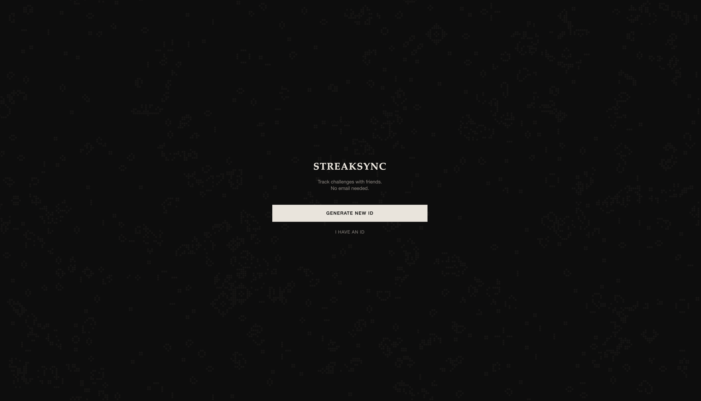

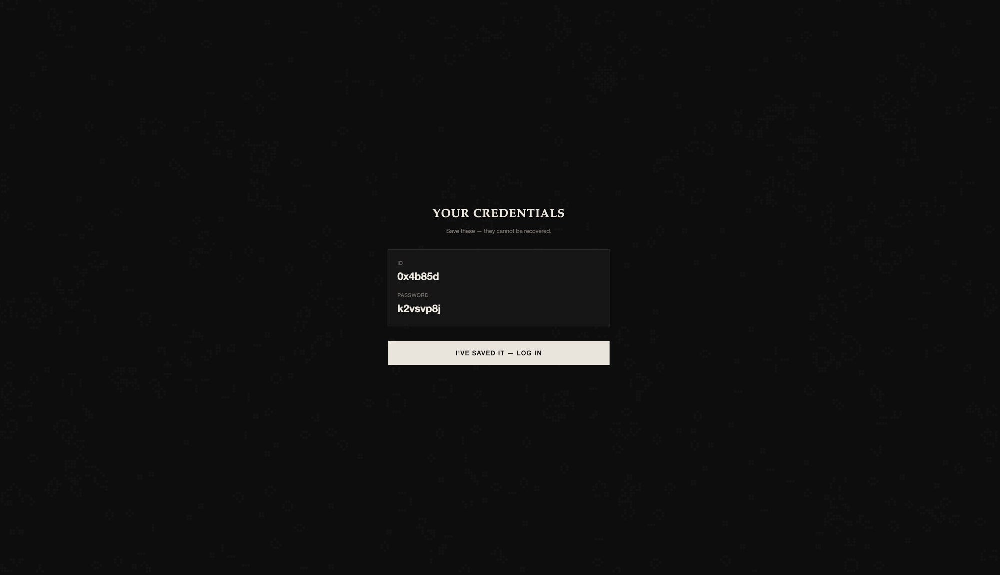

### 2. Your Dashboard

Conway's Game of Life runs in the background — unique to your ID. Your starred challenge heatmap shows below. All challenges listed with member counts.

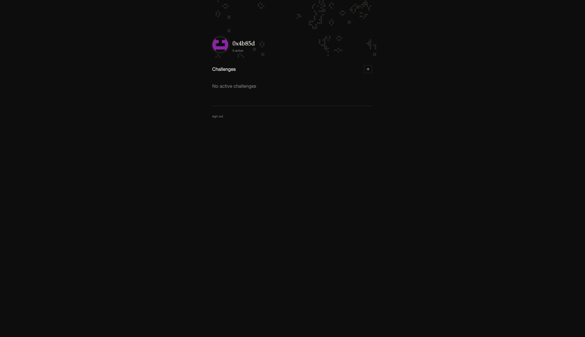

### 3. Create a Challenge

Set a name, description, duration (7-100 days), type, and visibility. That's it.

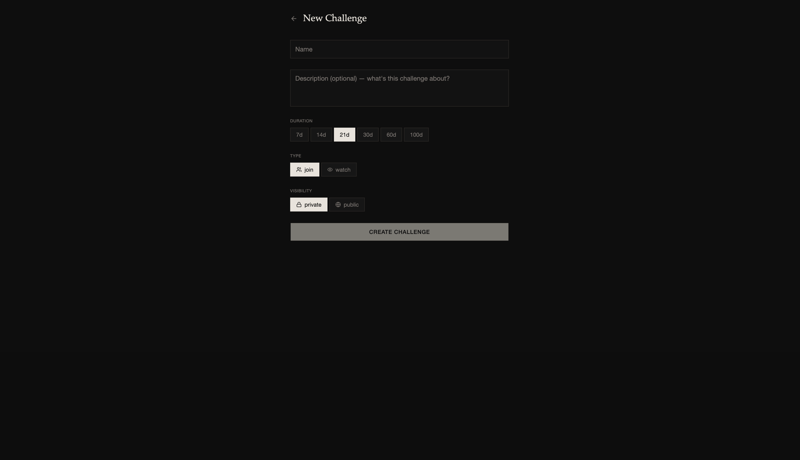

---

## Features

### Heatmap Tracking

GitHub-style contribution heatmap — 5 months visible with discrete month blocks. Green intensity shows completion level. Random red blinks on empty cells remind you of missed days. Green sparkles celebrate completions.

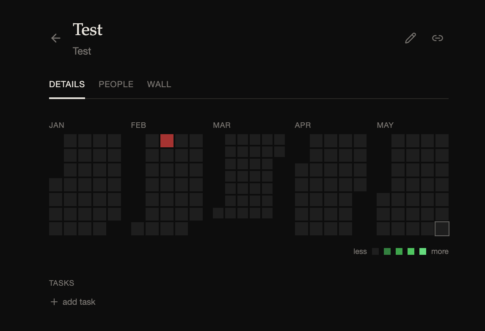

### Daily Tasks

Add recurring tasks to any challenge. One-tap check marks them done. Streaks count consecutive days completed.

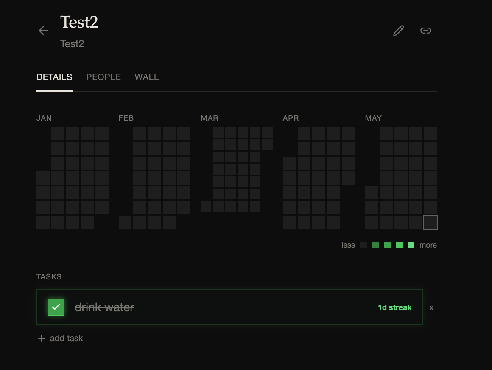

### Challenge Wall

A daily notes feed per challenge. Each member can post one note per day. Navigate to past dates to see what people wrote.

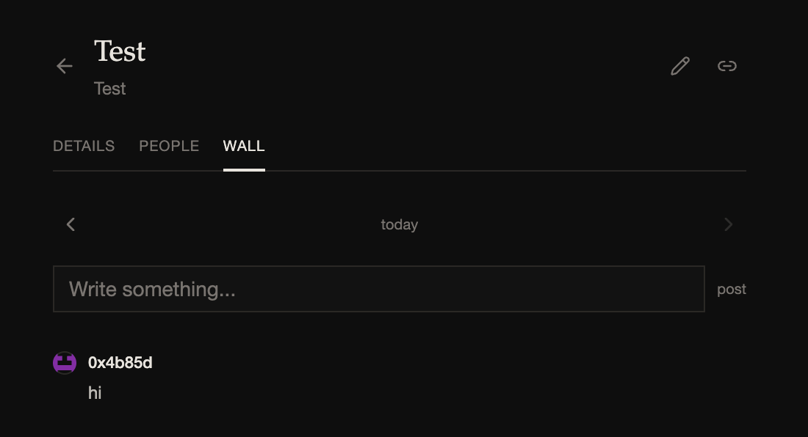

---

## Roles & Permissions

### Admin (Challenge Owner)

The person who creates a challenge is the admin. They can:

- Add and delete tasks
- Edit challenge name and description
- Approve or deny join requests (for private challenges)
- Share invite links

Admins are tagged with a red `ADMIN` badge on the dashboard.

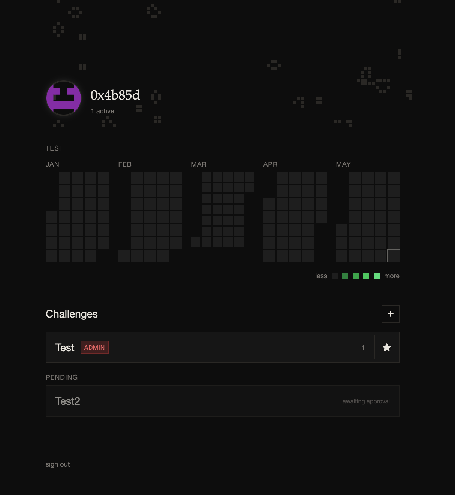

### Members

Members can:
- Check off daily tasks
- View all participants' heatmaps
- Post on the challenge wall
- Leave the challenge

---

## Public vs Private

### Public Challenges

- Anyone can discover and join instantly
- No approval needed
- Good for open community challenges

### Private Challenges

- Invite link required to find the challenge
- Joining sends a **pending request** to the admin
- Admin must approve before the user gains access
- The requesting user sees "awaiting approval" on their dashboard

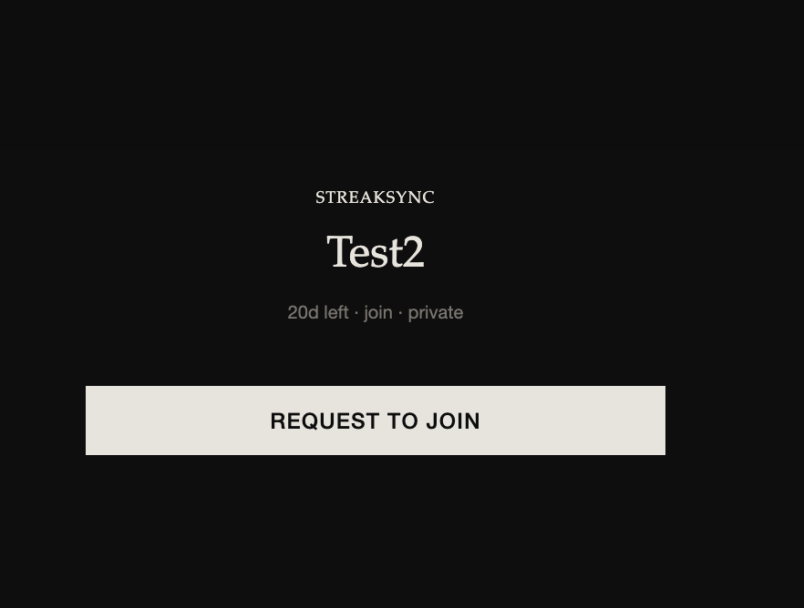


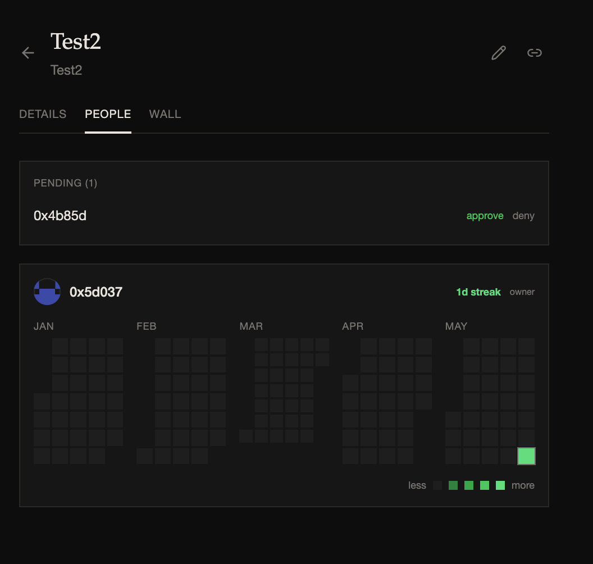

---

## Join vs Watch

### Join Mode

All members get the same tasks and track their own progress. Everyone builds their own heatmap. This is the collaborative mode — gym challenges, coding sprints, reading marathons.

### Watch Mode

Members can only view the owner's progress. They can't check tasks. Good for "follow my journey" challenges where one person shares accountability publicly.

---

## People Tab

See every participant's heatmap side by side. Compare streaks. The social pressure lives here.

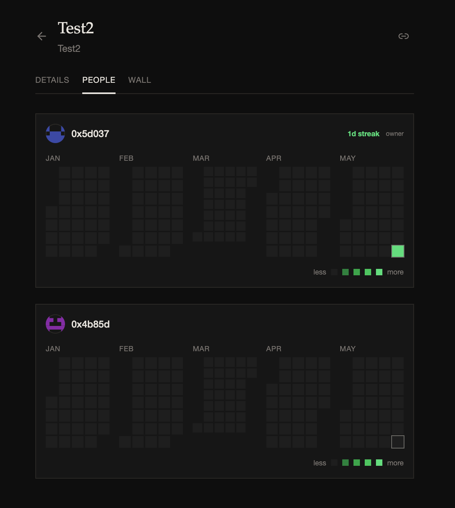

---

## Tech Stack

- **Frontend**: Next.js, TypeScript, Tailwind CSS, shadcn/ui
- **Backend**: Supabase (PostgreSQL, Auth, Realtime)
- **Hosting**: Vercel
- **Design**: Retro-minimal dark UI, Palatino headings, Helvetica body

## Self-Hosting

```bash
git clone https://github.com/YashasviChaurasia/StreakSync.git
cd StreakSync
npm install
cp .env.example .env.local
# Add your Supabase credentials to .env.local
# Run supabase/migrations/001_initial.sql in your Supabase SQL editor
npm run dev
```

## Live

[streak-sync-dusky.vercel.app](https://streak-sync-dusky.vercel.app)
